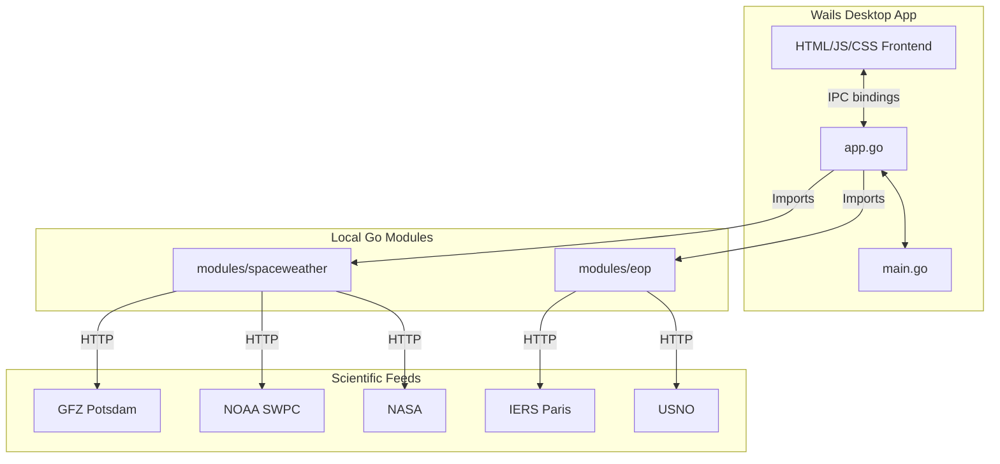

# Implementation Plan: Refactor Space Weather & EOP to Go Modules and Wails Desktop UI

This plan outlines the architecture and execution steps to refactor the existing Python-based offline Space Weather and Earth Orientation Parameters (EOP) compilers into separate, reusable Go modules, and present them in a single, modern desktop application using the Wails framework.

## Proposed Architecture



---

## User Review Required

> [!IMPORTANT]
> The new implementation will completely replace the Python codebase with Go modules. The Python GUI (tkinter-based) will be replaced with a modern, HTML/CSS/JS frontend powered by Wails (Vite + Vanilla JS).
>
> We will configure the Go modules to be loaded locally using Go's `replace` directives inside `wailsapp/go.mod`.

---

## Proposed Changes

### [New Component] Go Modules

We will create two separate Go modules representing the backend calculation and parsing engines:

#### [NEW] [go.mod](file:///C:/Users/baris/.gemini/antigravity/worktrees/spaceweather%20data/refactor-wails-go-modules/modules/spaceweather/go.mod)
* Space Weather Go module definition.

#### [NEW] [spaceweather.go](file:///C:/Users/baris/.gemini/antigravity/worktrees/spaceweather%20data/refactor-wails-go-modules/modules/spaceweather/spaceweather.go)
* Implements the compilation logic from `engine.py`.
* Downloads and caches files (GFZ Potsdam, NOAA SWPC, NASA).
* Implements calculations: Bartels Solar Rotation, J2000 Earth-Sun distance, Kp to ap (with interpolation), Cp and C9 indices, and 81-day centered and backward moving averages.
* Writes legacy text format (`SW-All.txt`) and CSV formats.
* Implements compatibility verification against live Celestrak data.

#### [NEW] [go.mod](file:///C:/Users/baris/.gemini/antigravity/worktrees/spaceweather%20data/refactor-wails-go-modules/modules/eop/go.mod)
* Earth Orientation Parameters Go module definition.

#### [NEW] [eop.go](file:///C:/Users/baris/.gemini/antigravity/worktrees/spaceweather%20data/refactor-wails-go-modules/modules/eop/eop.go)
* Implements the compilation logic from `eop_engine.py`.
* Downloads and caches EOP source files (USNO TAI-UTC, Paris Observatory C04, USNO Bulletin A).
* Parses fixed-width text data, computes DAT (atomic time offset), merges C04 observed data with Bulletin A predictions.
* Writes legacy text (`EOP-All.txt`) and CSV formats.
* Implements compatibility verification against live Celestrak data.

---

### [New Component] Wails Desktop Application

We will initialize and configure a Wails desktop project:

#### [NEW] [wails.json](file:///C:/Users/baris/.gemini/antigravity/worktrees/spaceweather%20data/refactor-wails-go-modules/wailsapp/wails.json)
* Wails application configuration (window size, title, assets configuration).

#### [NEW] [go.mod](file:///C:/Users/baris/.gemini/antigravity/worktrees/spaceweather%20data/refactor-wails-go-modules/wailsapp/go.mod)
* Main Wails app module, importing `spaceweather` and `eop` using `replace` directives:
  ```go
  replace github.com/btoktamis/spaceweather => ../modules/spaceweather
  replace github.com/btoktamis/eop => ../modules/eop
  ```

#### [NEW] [app.go](file:///C:/Users/baris/.gemini/antigravity/worktrees/spaceweather%20data/refactor-wails-go-modules/wailsapp/app.go)
* Exposes Go methods (bindings) to the frontend:
  * `CompileSpaceWeather(cacheDir, outDir string, format string) (Result, error)`
  * `CompileEOP(cacheDir, outDir string, format string) (Result, error)`
  * `LoadSpaceWeatherHistory() (Records, error)`
  * `LoadEOPHistory() (Records, error)`

#### [NEW] [main.go](file:///C:/Users/baris/.gemini/antigravity/worktrees/spaceweather%20data/refactor-wails-go-modules/wailsapp/main.go)
* Initializes the Wails window, binds `App`, and runs the application.

---

### [New Component] Frontend Dashboard

We will design a stunning modern dashboard with a dark theme (Catppuccin color scheme):

#### [NEW] [index.html](file:///C:/Users/baris/.gemini/antigravity/worktrees/spaceweather%20data/refactor-wails-go-modules/wailsapp/frontend/index.html)
* Core structure of the application. Includes sidebar navigation for switching between "Space Weather Compiler", "EOP Compiler", "Data Viewer", and "Charts/Trends".

#### [NEW] [style.css](file:///C:/Users/baris/.gemini/antigravity/worktrees/spaceweather%20data/refactor-wails-go-modules/wailsapp/frontend/src/style.css)
* Custom CSS implementation utilizing glassmorphism (`backdrop-filter`), CSS Grid/Flexbox layouts, glowing gradients, hover animations, and custom scrollbars.

#### [NEW] [main.js](file:///C:/Users/baris/.gemini/antigravity/worktrees/spaceweather%20data/refactor-wails-go-modules/wailsapp/frontend/src/main.js)
* Frontend logic interacting with Go bindings.
* Manages state, handles asynchronous compilation events (displaying running logs in real time), searches and filters compiled records, and draws SVG charts dynamically.

---

## Verification Plan

### Automated Tests
* We will verify compiled data against live Celestrak data using our newly written Go verification functions for both Space Weather (`verify_with_celestrak`) and EOP.
* We will check that the generated text output matches the column alignments and formats exactly.

### Manual Verification
* Run `wails dev` to run the app locally.
* Test compiling Space Weather and EOP data, verifying that logs print in real-time.
* View compiled tables and search/filter.
* Interact with the dynamic charts to check if they scale correctly.
* Run a production build of the Wails app using `wails build`.
